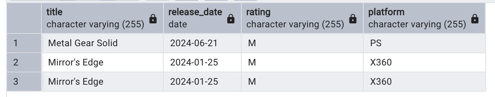

# Video Game Database

## Overview

This project involves building a video game database using the **ETL (Extract, Transform, Load)** process. The data was sourced by web scraping from [Metacritic](https://www.metacritic.com/), a popular website for game reviews and ratings.

## Technologies and Libraries

- **Python Libraries:** `requests`, `BeautifulSoup`, `pandas`, `datetime`, `CSV`, `time`
- **Database Management System:** PostgreSQL
- **Database Interface:** PG Admin

## Process

1. **Extract:** Data was scraped using `requests` and `BeautifulSoup` libraries.
2. **Transform:** Data was cleaned, formatted, and structured using `pandas` and `datetime`.
3. **Load:** The transformed data was loaded into a PostgreSQL database using PG Admin.

## ERD Diagram

Below is the ERD diagram for the database structure:

## Sample Queries

- Example queries demonstrating data retrieval and aggregation are below:

